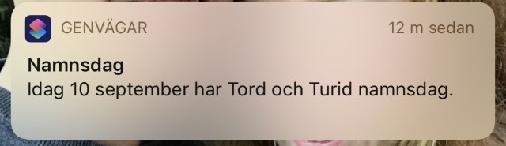

# ArvidsonFoto.se
**Namnsdag**, är ett väldigt litet projekt jag skapade för att kunna få namnsdags aviseringar i min mobil, varje dag vid 09:00.  

## Webbsida
En länk där du kan se webbsidan i sin helhet:  
[https://pownas.github.io/Namnsdag/](https://pownas.github.io/Namnsdag/)
  
Samt en instruktion hur man skapar en notis på sin iPhone:  
[https://pownas.github.io/Namnsdag/docs](https://pownas.github.io/Namnsdag/docs/)

## Källkod
Länk till GitHub-repository:   
[GitHub.com/pownas/Namnsdag](https://github.com/pownas/Namnsdag)

## Bilder
  
En namnsdags-notis som skickas dagligen till iPhone   

Webbsidan för projektet

Dokumentation över hur man skapar en iPhone-notis se: ([https://pownas.github.io/Namnsdag/docs](https://pownas.github.io/Namnsdag/docs/))  
  
