# 2019HT-Delkurs4-MIB-application
 Men in Black applikationen vi byggde i Java-kursen. Ett system för att administrera och hålla reda på de Aliens och Agenter som befinner sig på jorden.  

 ## Källkod
Länk till GitHub-repository:  
[GitHub.com/pownas/2019HT-Delkurs4-MIB-application](https://github.com/pownas/2019HT-Delkurs4-MIB-application) (privat)

## Videor
En film där applikationen presenteras:  
[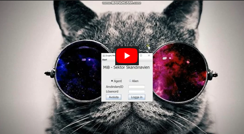](https://youtu.be/Mh9oUfMBomw)

# Bilder ifrån applikationen
Här nedan visas ett gäng bilder ifrån applikationen: 

ER-diagram, över MiB applikationen som skulle byggas
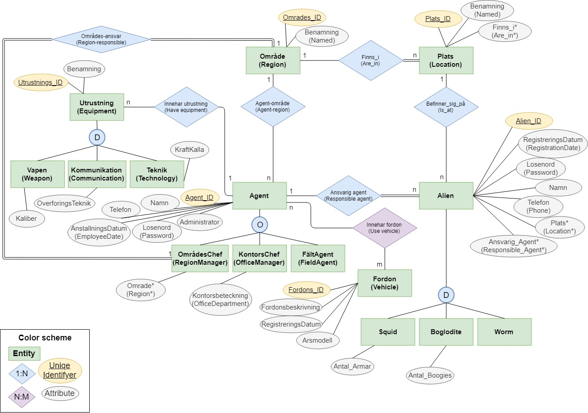

Inloggningsruta  
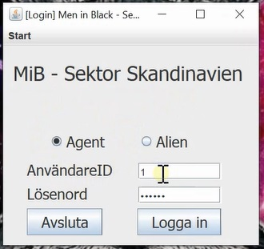

Startsidan  
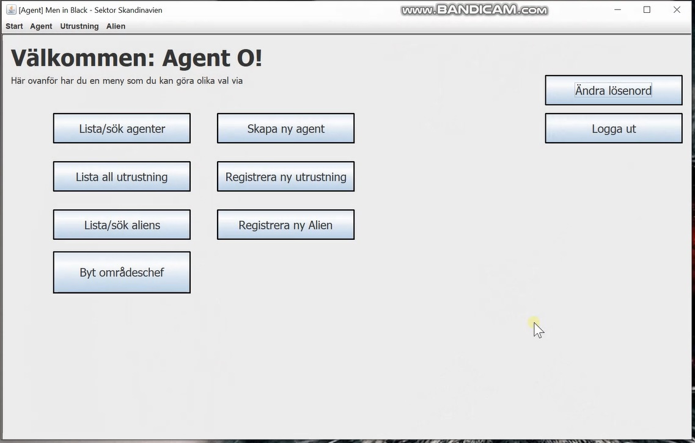

Lista-Agenter  
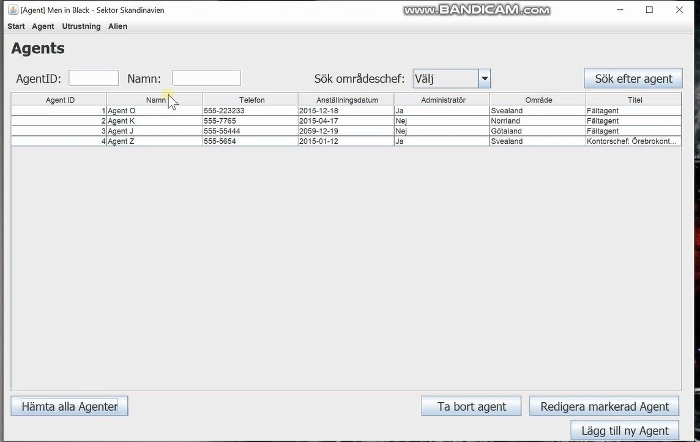

Skapa-Ny-Agent  
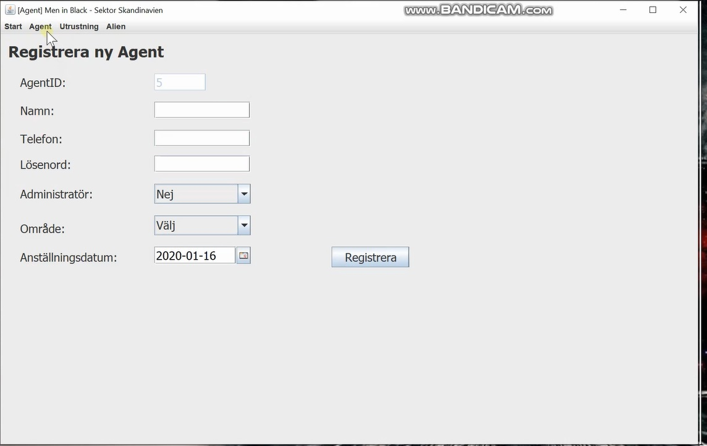

Edit-Chef  

Lista-Utrustning  
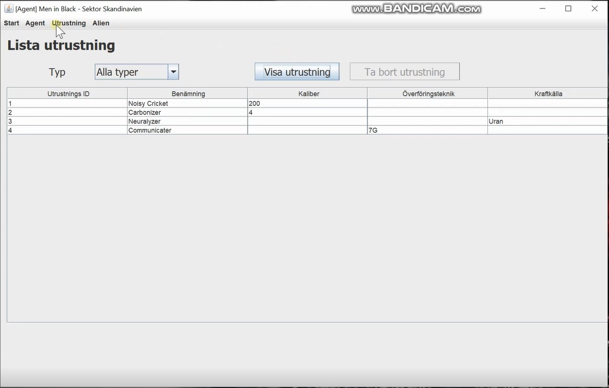

Add-Utrustning  
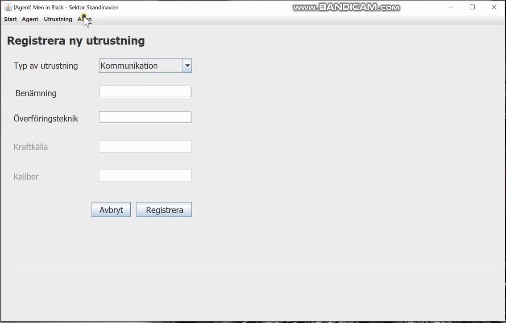

Lista-Aliens  
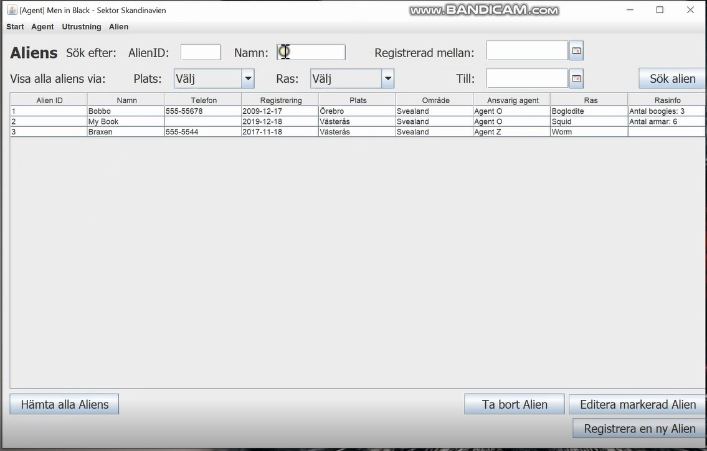

Skapa-Ny-Alien  

Byt-Password-Alien  
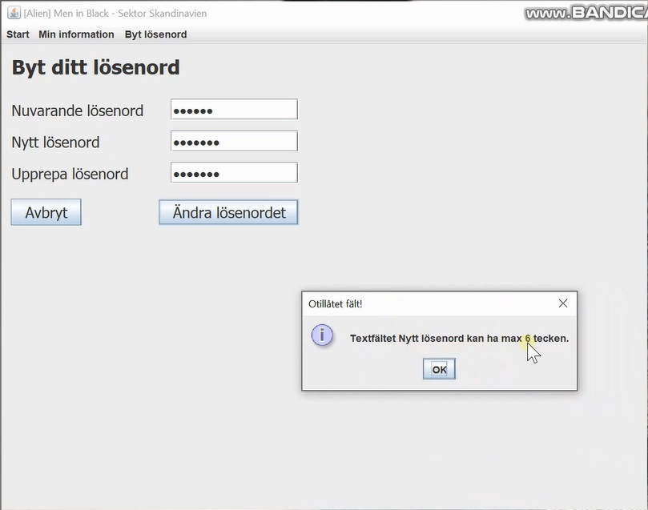

Byta-Password-Lyckades  
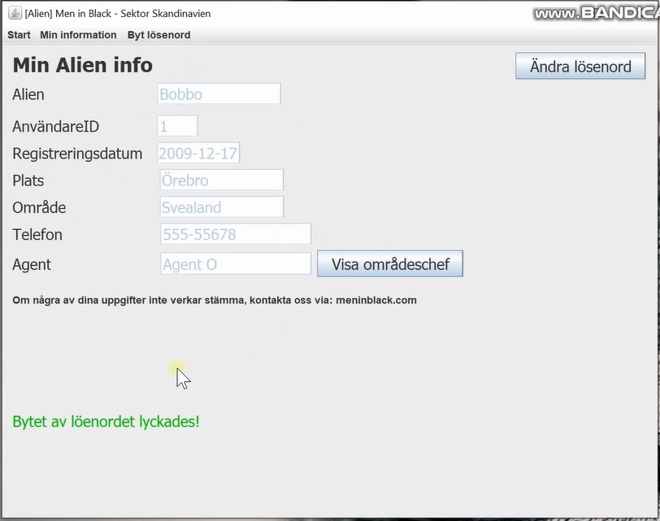