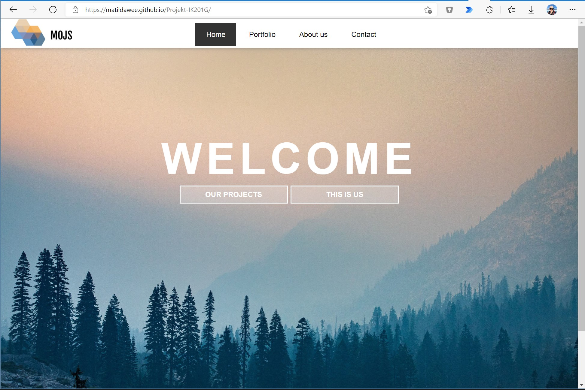
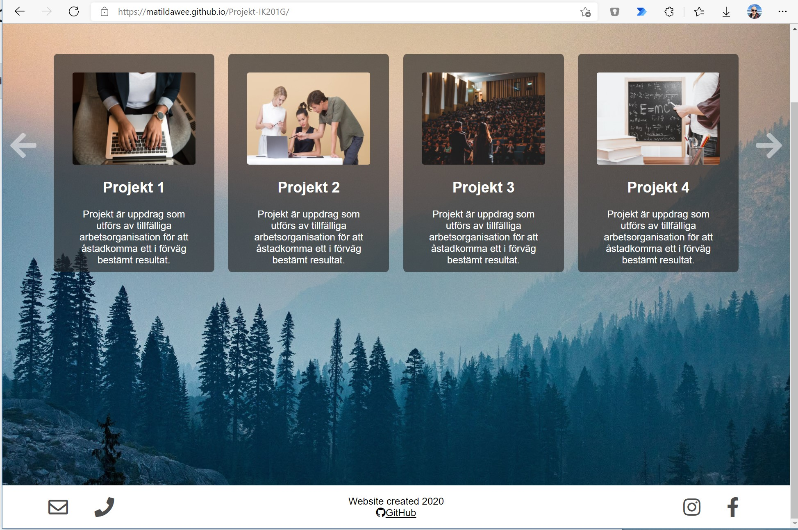
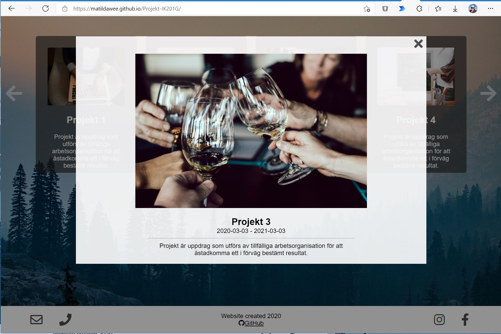
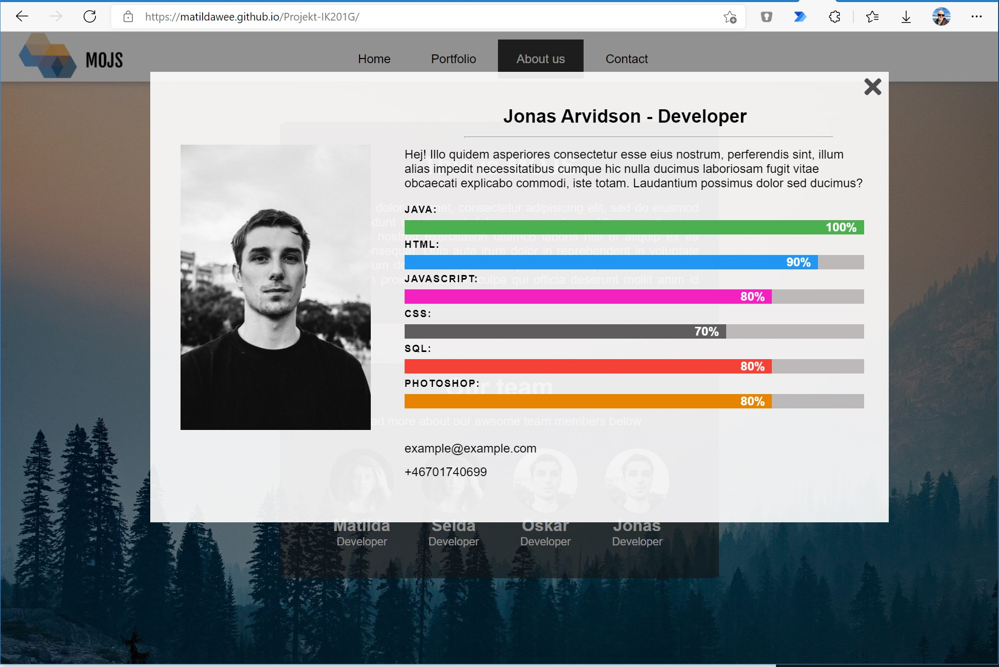
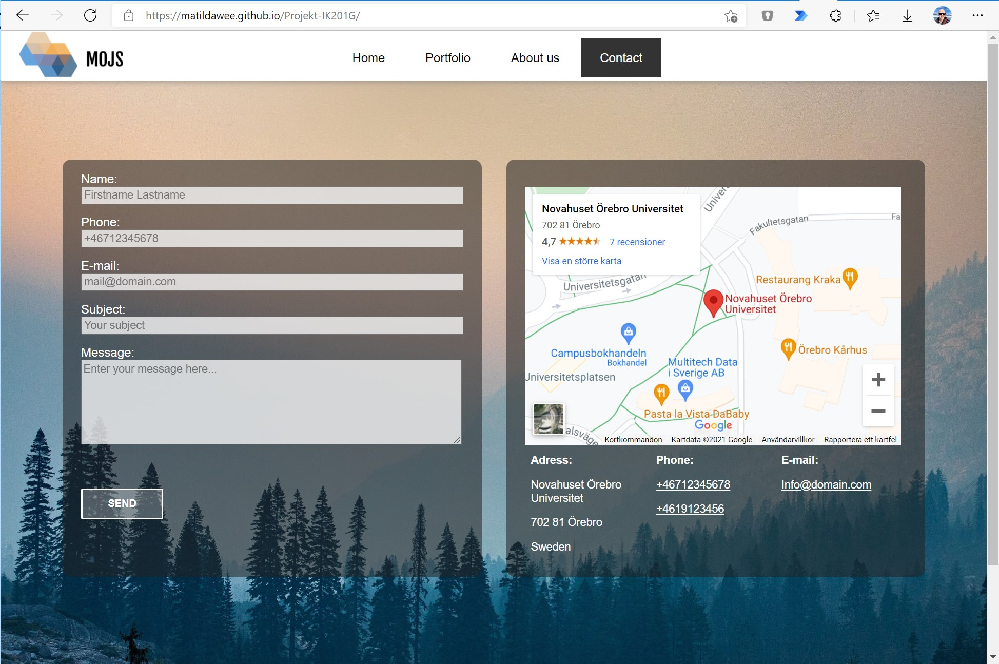

# 2020HT-IK201G-MOJS-projekt
MOJS-projektet, var en hemsida vi skapade i kursen **IK201G-Klientprogrammering för webbsystem, fortsättningskurs**, för att lära oss mer om HTML, CSS och JavaScript. Sidan har ett kontakt-formulär som lagrar ned uppgifter till localStore på ett rätt snyggt sätt. 

## Webbsida
En länk där du kan se webbsidan i sin helhet:  
[https://matildawee.github.io/Projekt-IK201G](https://matildawee.github.io/Projekt-IK201G/)

## Källkod
Länk till GitHub-repository:  
[GitHub.com/matildawee/Projekt-IK201G](https://github.com/matildawee/Projekt-IK201G)

## Bilder
  
Startsida  

  
Portfolio-sidan  

  
Portfolio i fullskärm  

  
Om utvecklare-sidan  

  
Kontakt-formulär  

  
  