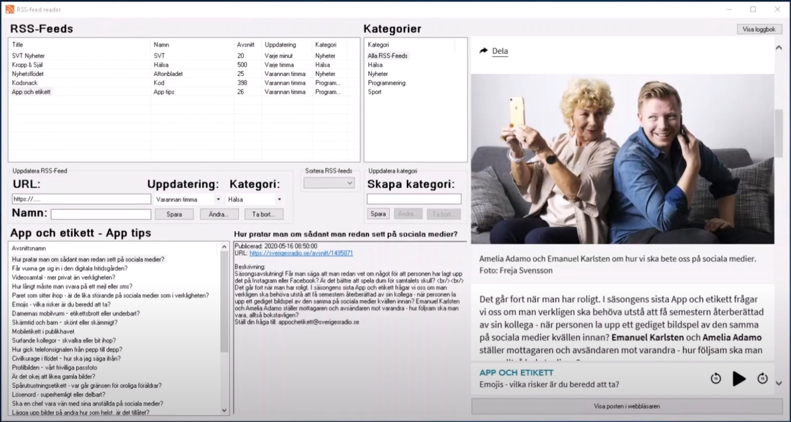

# 2020HT-IK202G-Project
Inom kursen **IK202G-Objektorienterad programmering med C#, fortsättningskurs**, så skapade vi **RSS feed reader**. Det är en ASP.NET applikation skriven i C# WinForms, för att lära oss objektorienterad programmering och att hämta data ifrån RSS feeds via ett Datalager.

## Källkod
Länk till GitHub-repository:  
[GitHub.com/pownas/2020HT-IK202G-Project](https://github.com/pownas/2020HT-IK202G-Project) (privat)

## Bilder
Bilder ifrån systemet:  

## Video
Länk till genomgång av programmet på YouTube:  
[https://youtu.be/XWx0BXlJte4](https://youtu.be/XWx0BXlJte4)