# 2020HT-IK204G-DejtingSiten-iMatch
Inom kursen **IK204G-Webbsystem med .NET, fortsättningskurs**, så skulle vi skapa en dejting sida i ASP.NET MVC. Vi skapade då en sida vi valde att kalla för iMatch. Vi skrev sidan i C#, och lärde oss massvis om hur man kan använda EntityFramework och Migrations i denna kursen för att skapa databaser via Code-first.

## Webbsida
Finns tyvärr ingen sida där man kan testköra detta projektet live.

## Källkod
Länk till GitHub-repository:  
[GitHub.com/pownas/2020HT-IK204G-DejtingSite-iMatch](https://github.com/pownas/2020HT-IK204G-DejtingSite-iMatch) (privat)

## Bilder
 
Startsida  
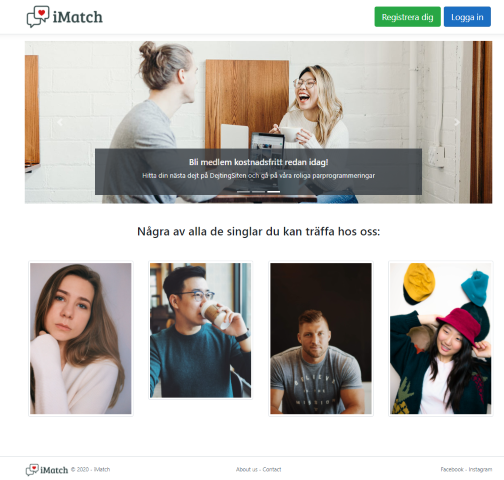

Registrera dig, validering  
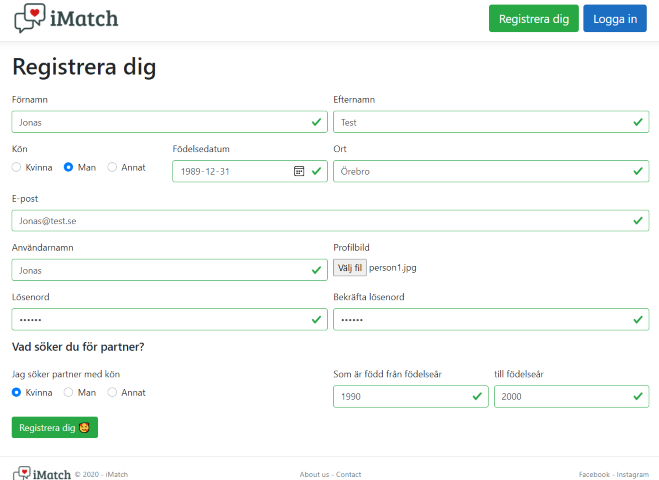

Registrera dig, validering misslyckas  
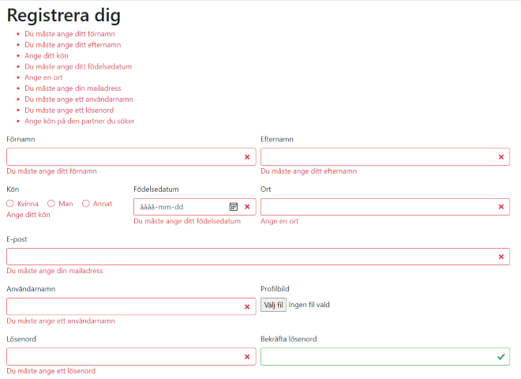

Login-sidan  
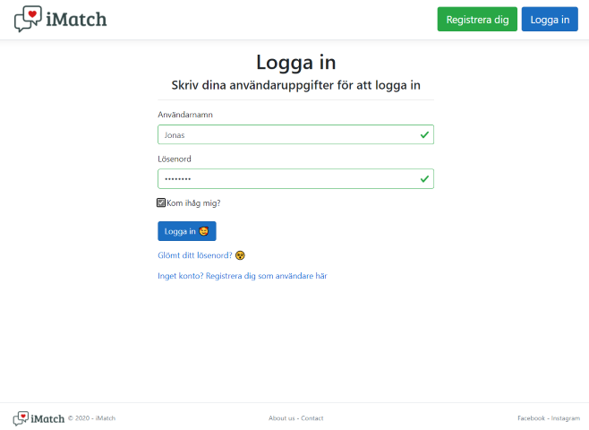

Sin egna användarprofil  
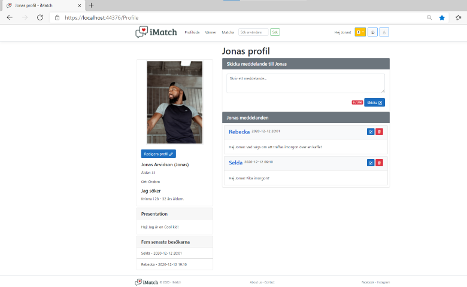

Notiser  
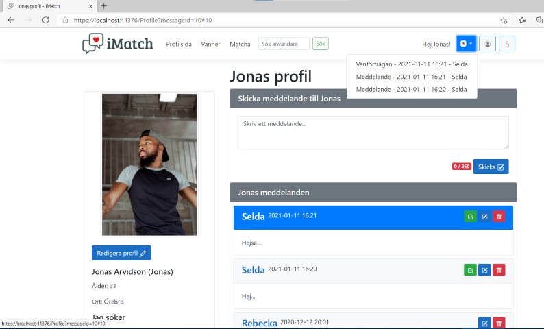

Notis, när man klickats på en notis ifrån Matilda i detta fallet, så markeras denna med gult  
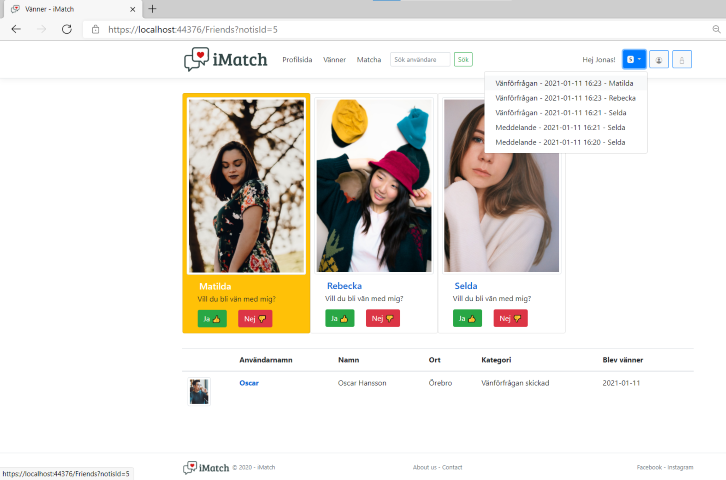

Notis, nedad förfrågan av Oscar  
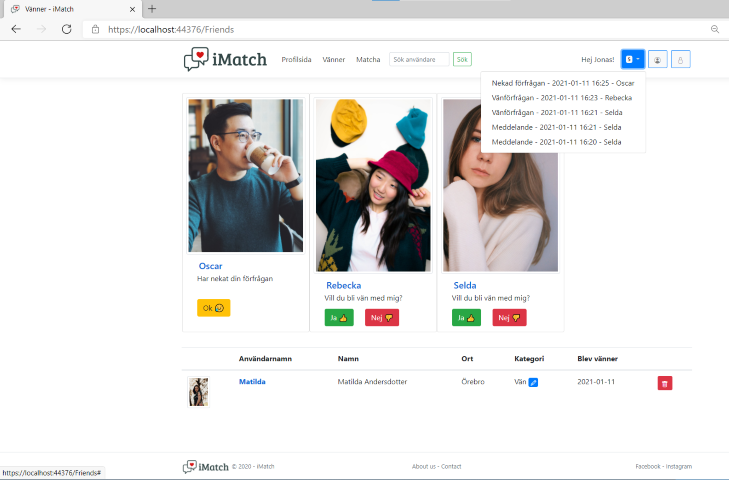

Matcha med andra på sidan  
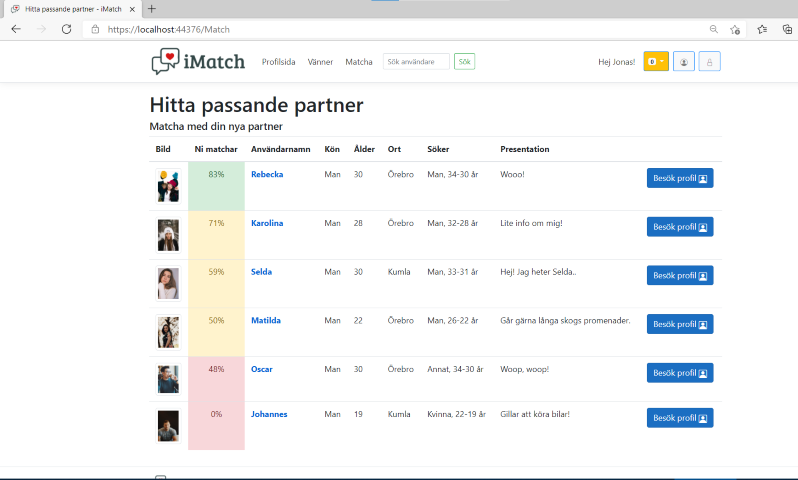

Kontoinställningar  
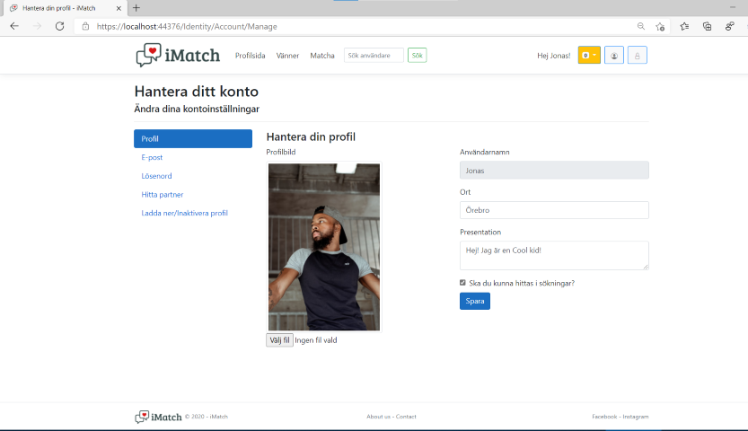

Sida för att kunna ladda ned alla sina personliga data  
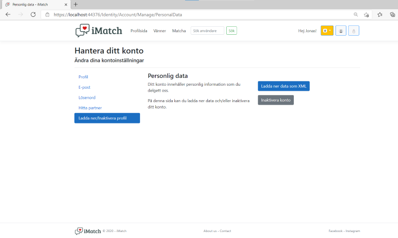

Sökning efter någon annan på sidan  
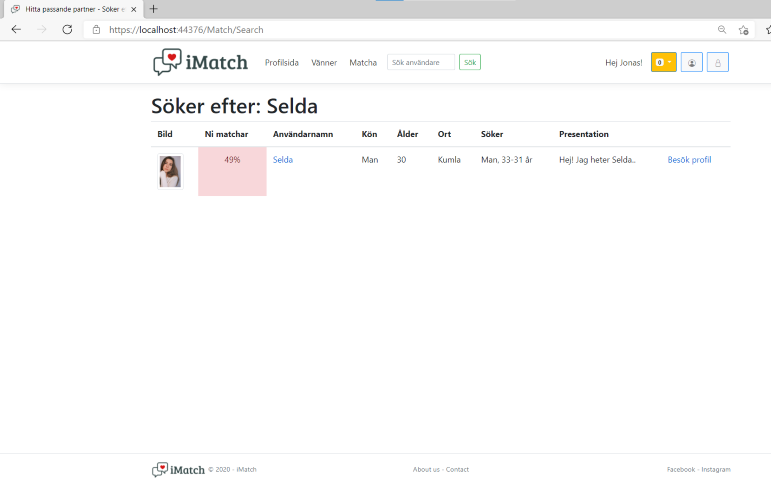

Du kan byta kategorier för dina vänner  
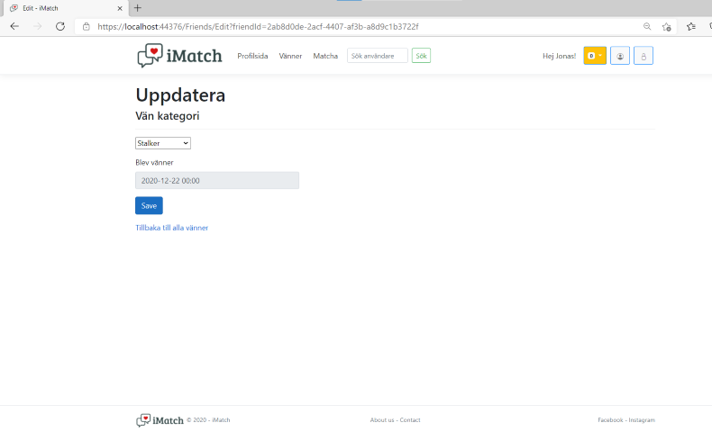
