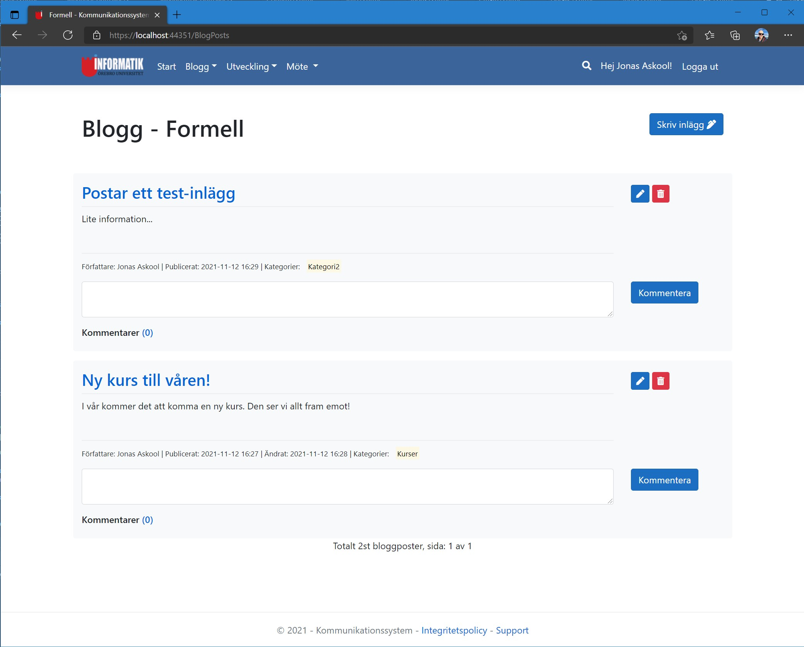
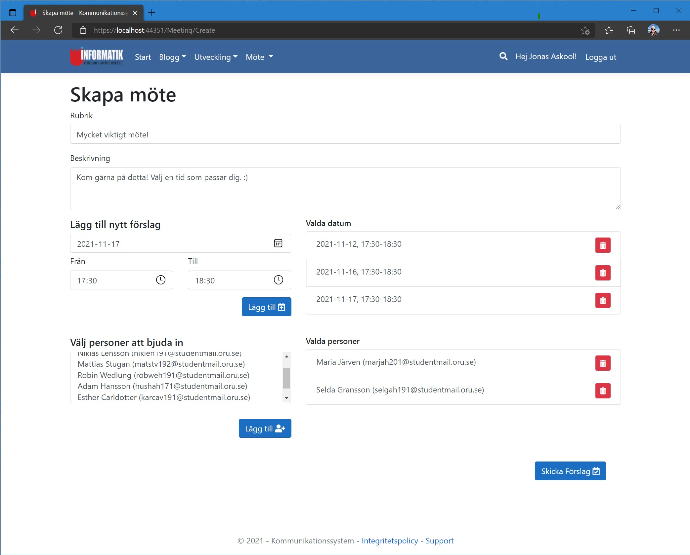
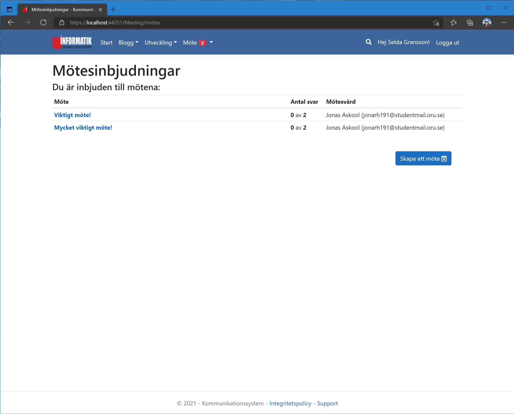
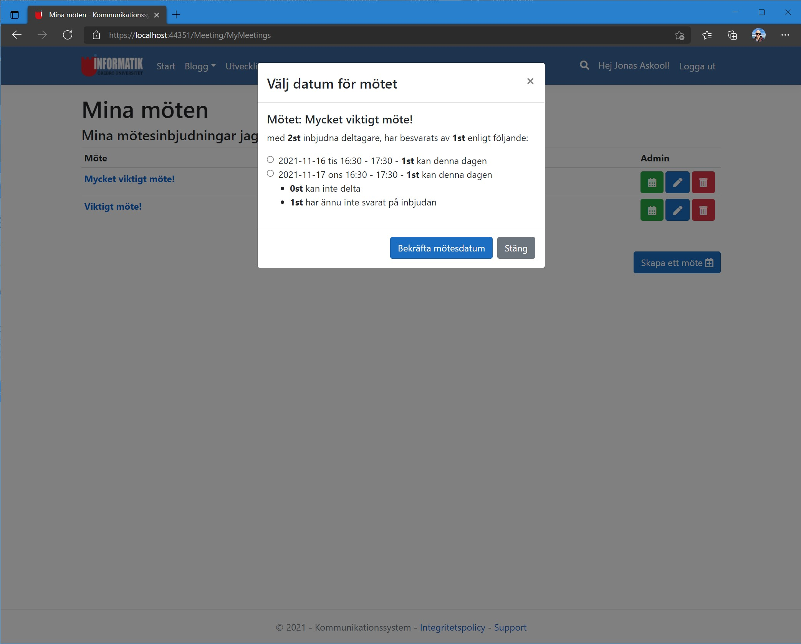

# 2021VT-IK207G-Scrum-Oru webbsida
Inom kursen **IK207G-Systemutvecklingsprojekt med Scrum och Extreme Programming, fortsättningskurs**, så skulle vi skapa ett "Kommunikationsverktyg för Informatik vid Örebro universitet". Detta gjorde vi genom att arbeta i ett team på 10st personer, varav jag agerade **Scrum Master** i detta teamet. 
  
Sidan skulle ha en bloggfunktion, det skulle gå att hantera interna mötesbokningar, det skulle gå att skicka e-post och SMS ifrån systemet, samt man skulle kunna ha administratörsfunktioner och hantera roller för alla lärare på skolan. 
  
Vi lyckades uppfylla alla krav med vårt system som vi skapade till lärarna i en ASP.NET MVC-applikation. 

## Webbsida
Finns tyvärr ingen sida där man kan testköra detta projektet live.

## Källkod
Länk till GitHub-repository:  
[GitHub.com/pownas/2021VT-IK207G-Team8-Scrum](https://github.com/pownas/2021VT-IK207G-Team8-Scrum) (privat)

## Bilder
  
Startsidan när man har loggat in  

Registrera dig  

Registrera dig, validering misslyckas  

Login-sidan, vilken också är startsidan för systemet, eftersom det kräver att man ska vara inloggad  

Den formella bloggen  

En bloggkommentar  

Skapa ny bloggpost, och kan lägga till filer  

Inlägget som skrevs har sparats i databasen  

Skapa nytt möte  

Fyllt i för ett nytt möte och valt tider och deltagare  

Möten som man själv har kallat till  

Ingen har dock ännu svarat att de kan delta på mötet  

Inloggad som Selda istället för Jonas, har fått 2st mötesinbjudningar  

Lista som visar alla mötesinbjudningar  

Väljer datum som passar och sparar valen  

Jonas ser då i systemet att en person besvarat mötet, och kan välja datum för mötet  

Mötet finns sedan i Jonas personliga kalender  

Information om mötet i kalendern  

Sökning efter bloggposter   

Hantera kontot  

Kan som administratör i systemet byta roller på andra personer  

Kan även radera användare som administratör  

Mail när man blivit kallad till ett möte  

Mail när ett möte besvarats av en inbjuden person  

Mail när ett möte fått ett fast datum satt, till alla mötesdeltagare  
