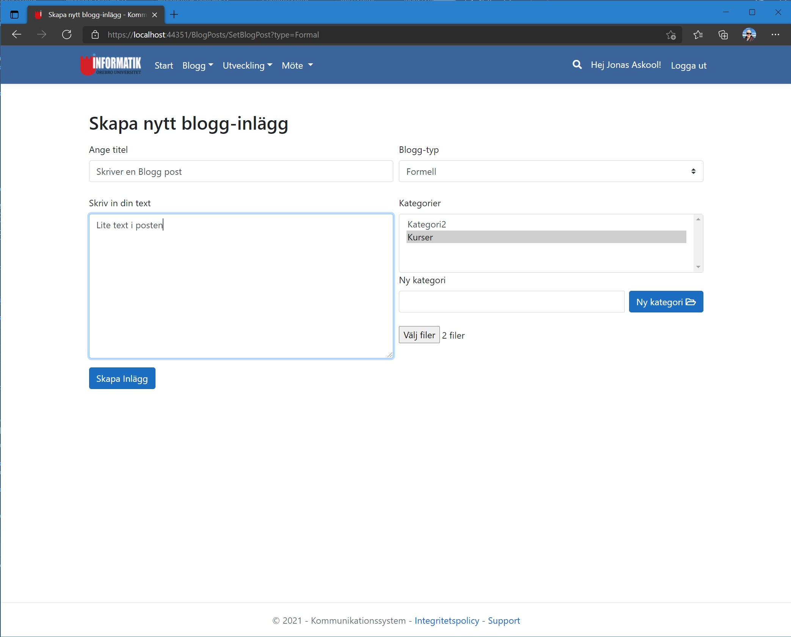

# 2021VT-IK207G-Scrum-Oru webbsida
Inom kursen **IK207G-Systemutvecklingsprojekt med Scrum och Extreme Programming, fortsättningskurs**, så skulle vi skapa ett "Kommunikationsverktyg för Informatik vid Örebro universitet". Detta gjorde vi genom att arbeta i ett team på 10st personer, varav jag agerade **Scrum Master** i detta teamet. 
  
Sidan skulle ha en bloggfunktion, det skulle gå att hantera interna mötesbokningar, det skulle gå att skicka e-post och SMS ifrån systemet, samt man skulle kunna ha administratörsfunktioner och hantera roller för alla lärare på skolan. 
  
Vi lyckades uppfylla alla krav med vårt system som vi skapade till lärarna i en ASP.NET MVC-applikation. 

## Webbsida
Finns tyvärr ingen sida där man kan testköra detta projektet live.

## Källkod
Länk till GitHub-repository:  
[GitHub.com/pownas/2021VT-IK207G-Team8-Scrum](https://github.com/pownas/2021VT-IK207G-Team8-Scrum) (privat)

## Bilder
  
Startsida  

Registrera dig, validering  

Registrera dig, validering misslyckas  

Login-sidan  

Sin egna användarprofil  

Notiser  

Notis, när man klickats på en notis ifrån Matilda i detta fallet, så markeras denna med gult  

Notis, nedad förfrågan av Oscar  

Matcha med andra på sidan  

Kontoinställningar  

Sida för att kunna ladda ned alla sina personliga data  

Sökning efter någon annan på sidan  

Du kan byta kategorier för dina vänner  

Du kan byta kategorier för dina vänner  

Du kan byta kategorier för dina vänner  

Du kan byta kategorier för dina vänner  

Du kan byta kategorier för dina vänner  

Du kan byta kategorier för dina vänner  

Du kan byta kategorier för dina vänner  

Du kan byta kategorier för dina vänner  

Du kan byta kategorier för dina vänner  

Du kan byta kategorier för dina vänner  

