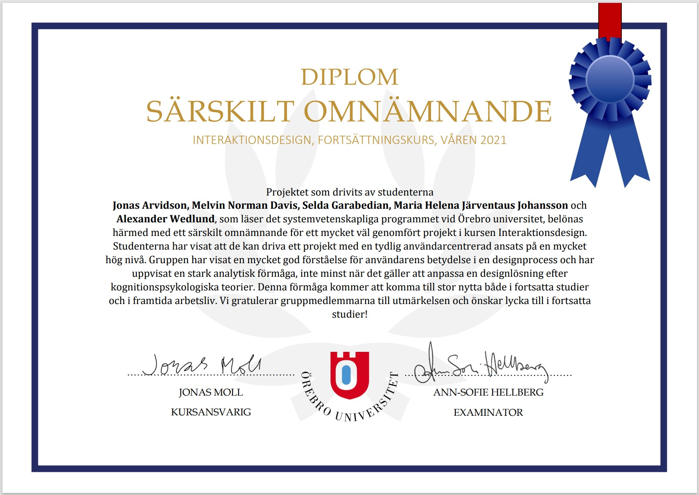

# 2021VT-IK208G-Interaktionsdesign, mobilapp: Penny Hiking
Inom kursen **IK208G-Interaktionsdesign, fortsättningskurs**, så angavs det i projektbeskrivningen att projektets huvuduppgift är att utveckla en ny interaktiv designlösning som bidrar till att medborgare kan upptäcka Örebro.  
Vi tolkade detta till att utveckla en mobilapplikation som underlättar för vandringsintresserade som vill hitta information om vandringsleder (uppfyller projektkravet: informationstillgänglighet), hur de kan hitta till och i dem (uppfyller projektkravet: navigering) samt kommunicera med andra användare (uppfyller projektkravet: interaktionsmöjlighet).
  
Varje vecka skrev vi löpande dagbok i form av bloggposter i den blogg som går att besöka nedan.  
  
Detta var en rolig och lärorik kurs som resulterade i en snyggt designad mobil-applikation vi kallade: **Penny Hiking**.  

Vi fick även ett Diplom av lärarna i kursen, för ett av de bäst utförda design-projekten i kursen: [Diplom-Särskilt omnämnande](https://pownas.se/intyg/VT2021-InteraktionsDesign-Omnamnande.pdf) 
  
## Webbsida
Vi bloggade nästan varje dag på bloggen:  
https://interaktionsdesignvt21grp3.wordpress.com/ 
  
Samt Hi-Fi prototypen för appen går att testa via:  
https://xd.adobe.com/view/d0953dfb-1f04-45dc-9b1a-602c3a24a73a-85c6/?fullscreen
  
## Källkod
Finns ingen källkod för applikationen, då den enbart skapats som prototyp mock-ups i Adobe XD.  

## Videor
  
Penny Hiking (Konceptuell reklamfilm)
https://youtu.be/Q-qzFu60Fc4 

Penny Hiking (Demonstrationsfilm av mobilapplikationen)
https://youtu.be/okfq_Gz5bkc 

Första Lo-Fi prototypen som användartestades:  
https://youtu.be/Xtw6hyIyggA 

## Bilder
  
Affinitetsdiagram över systemet.  

Vår primärpersona, vi designade systemet för Gunhild.  

Ali, vår sekundärpersona.  

Lo-Fi prototyp av vår applikation.  

Mental modell, över hur navigeringen i appen ska hänga ihop.  

Design komponenter i ett första skede.  

Designdokument (designspecifikation), över vilka färger och typsnitt vi skulle använda i appen.   

Designdokument över vilka designkomponenter vi skulle använda i appen.  

Interaktionsflöde mellan alla mock-up bilder i Adobe XD. Där man ser hur allt hänger ihop.  

Splashscreen och startsidan i appen.  

Första design av användarprofil (har även utvecklats vidare i sista bilden).  

Före/efter design av Startsida/Navigering.  

Före/efter design av Informationssidan.  

Före/efter design av Sidhuvudet.   

Före/efter design av Chatten.  

Före/efter design av Navigera till vandringsled.   

Före/efter design av Navigerings meny.   

Före/efter design av Navigera på vandringsled.   

Slutprototyp: Starsidan   

Slutprototyp: Splashscreen   

Slutprototyp: Hemskärmen  

Slutprototyp: Navigera till vandringsled, sökning  

Slutprototyp: Navigera till vandringsled, sökresultat  

Slutprototyp: Navigera till vandringsled, guidad navigering  

Slutprototyp: Navigera på vandringsled, sökning  

  

Slutprototyp: Navigera på vandringsled, sökresultat och navigering vart man är på leden  

  

Slutprototyp: Diskussionsforum  

  

Slutprototyp: Kommentera i ett diskussionsforum  

  

Slutprototyp: Chatt  

  

Slutprototyp: Svara på ett chattmeddelande  

  

Slutprototyp: Information om vandringsleder   

  

Slutprototyp: Information om en specifik vandringsled  

  

Slutprototyp: Profilsidan för huvudpersonan, Gunhild  

Diplom vi fick av lärarna för väl utfört arbete

